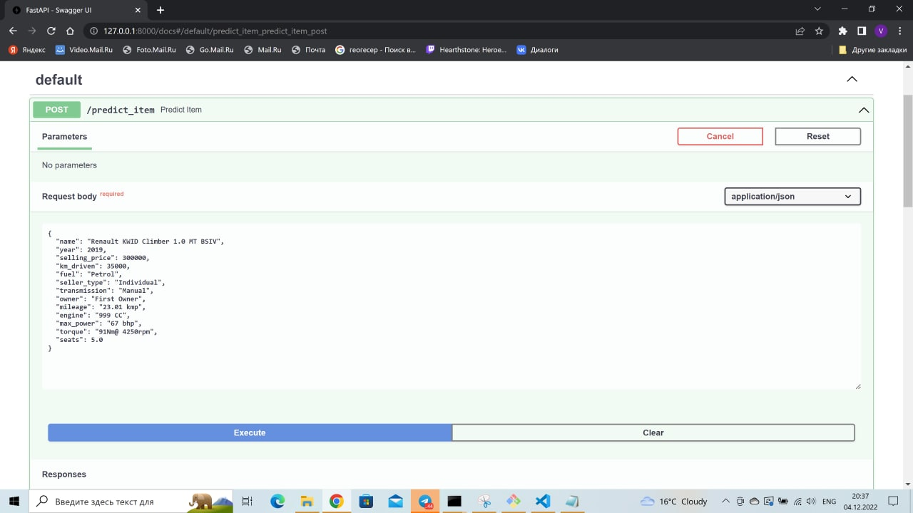
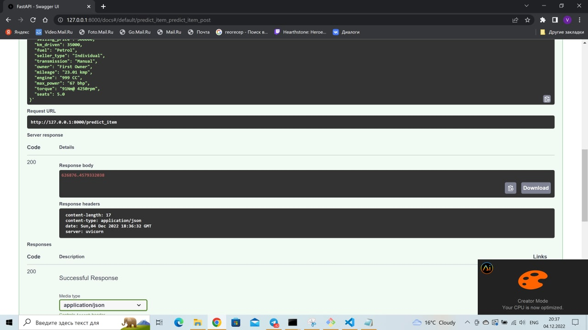
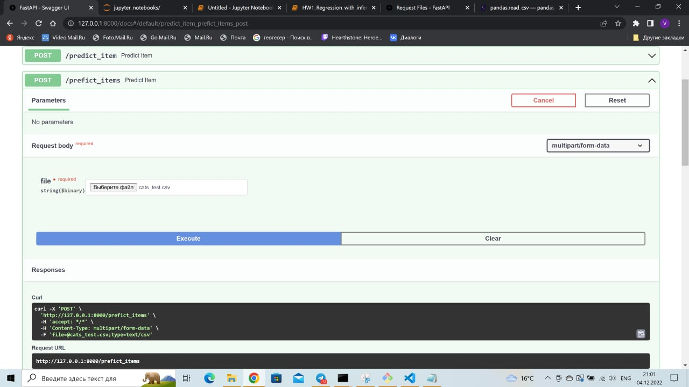
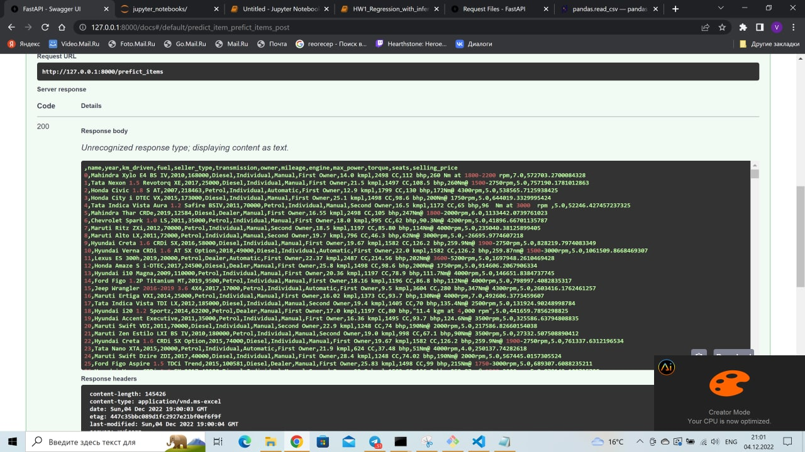

# Отчет

## Что было сделано

### Основная часть и визуализация

В главной части все было сделано по инструкции, поэтому подробно здесь писать об этом не буду. Из дополнительного нарисовал распределения всех признаков и рассеяние целевой переменной по всем, в том числе и по категориальным, признакам. Разделил колонку torque на две колонки (torque и max_torque) с помощью регулярных выражений, привел колонку torque к единицам Nm. Также провел feature engineering.

### Feature Engineering

* Вместо удаления колонки name сделал из нее колонку брендов.
* Удалил колонку torque из-за сильной корреляции с max_engine и max_power.
* Превратил max_torque_rpm из числовой переменной в категориальную (категории [max_torque_rpm < 2500] и [max_torque_rpm >= 2500]). К такому решению подталкнула диаграмма рассеяния.
* Прологарифмировал колонку km_driven, что увеличило корреляцию с целевой переменной.
* Удалил колонку mileage из-за очень низкой корреляции с целевой переменной.
* В колонке owner объединил категории Third Owner и Fourth & Above Owner в категорию Forth & Above Owner.
* В той же колонке убрал категорию Test Drive Car, как экстремально малочисленную, в многочисленную категорию First Owner.
* Добавил колонку квадратов признака year.
* Пропуски заполнил медианами.
* Категориальные переменные закодировал с помощью TargetEncoder со сглаживанием smoothing=1.
* Стандартизировал переменные.
* Отвалидировал и обучил с помощью GridSearchCV модели Lasso и Ridge.

### FastAPI

Реализовал сервис на FastAPI.

## Результаты

Модели из основной части не дали хорошего результата. После feature engineering'а получилось обучить модель Ridge с r2_score = 0.737 на тестовом датафрейме и показателем бизнес метрики 0.242. 

## Самые значимые улучшения

Наиболее серьезный вклад в бустинг внесли добавление брендов автомобиля, вместо удаления колонки name, использование TargetEncoder для кодирования категориальных признаков и квадратичная зависимость от признака year. TargetEncoder справился с задачей существенно лучше OneHotEncoder'а (можно убедиться в этом, посмотрев на score, который выдает ohe в основной части), а добавление брендов как признака увеличило r2_score с 0.6 до 0.7.

## Что не вышло

* Разобраться, как по-другому заполнять признаки кроме как медианами. Добавления dummy столбцов о том, что столбец был пропуском не дало особых результатов. Я думал воспользоваться IterativeImputer от sklearn, но решил, что в домашке ждут чего-то попроще, чем использование эксперементальных алгоритмов. Обучить отдельную линейную модель для заполнения пропусков не хватило времени.

* Придумать новые признаки кроме категориальной версии max_torque_rpm и колонки брендов. Как достать из колонки name что-то кроме брендов не очень понятно из-за отсутствия какого-то формата названия для разных автомобилей. Добавление новых признаков вроде max_power / engine (мощность на литр) или mileage * engine (сколько можно проехать на полном баке) не дало никаких результатов или делало хуже.

* Разобраться с выбросами. При попытке отбросить выбросы в колонке selling_price или же ограничить их определенным квантилем модель становилась хуже. Единственный "выброс", с которым удалось разобраться - это категория Test Drive Car в колонке owner.

* При загрузке модели в .pkl и выгрузке его в проекте fastapi, не смогу разобраться, как правильно выгрузить кастомный класс CustomTransformer, который использовался в первой версии пайплайна. Пришлось перейти к ColumnTransformer, который не сохраняет датафрейм в виде датафрейма. Благо следующим этапом в пайплайне была уже сама модель, и сохранение в виде датафрейма не потребовалось.

## Скриншоты

### Предсказание на одном объекте

### Предсказание на файле

